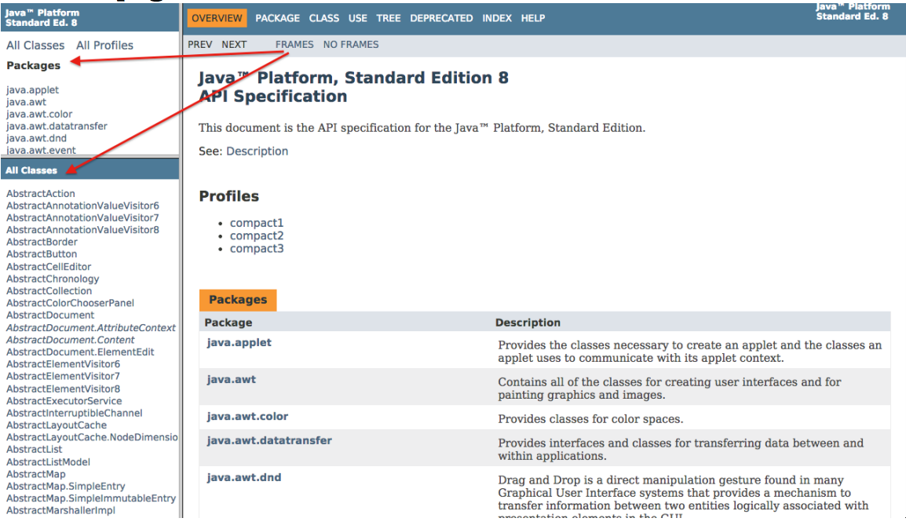
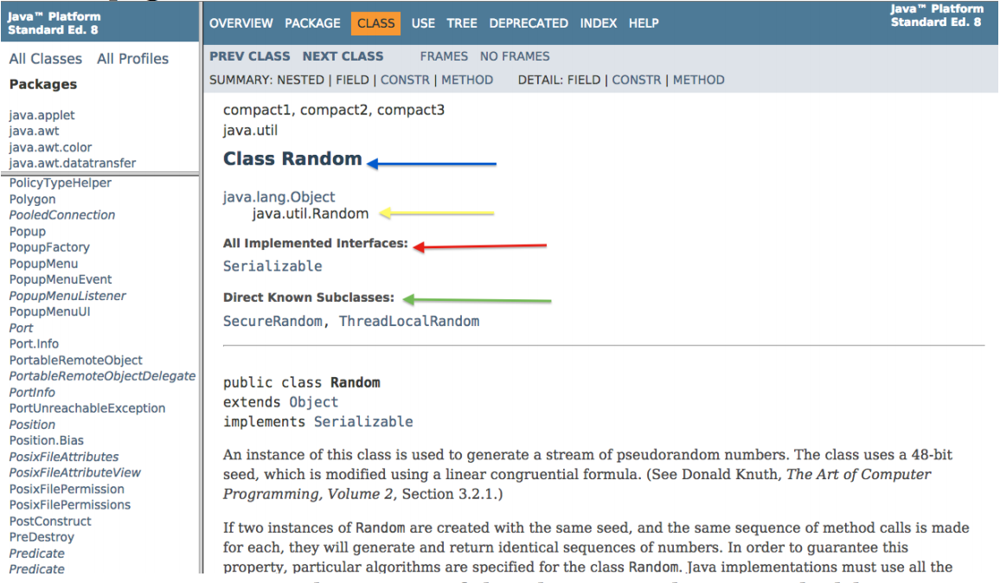
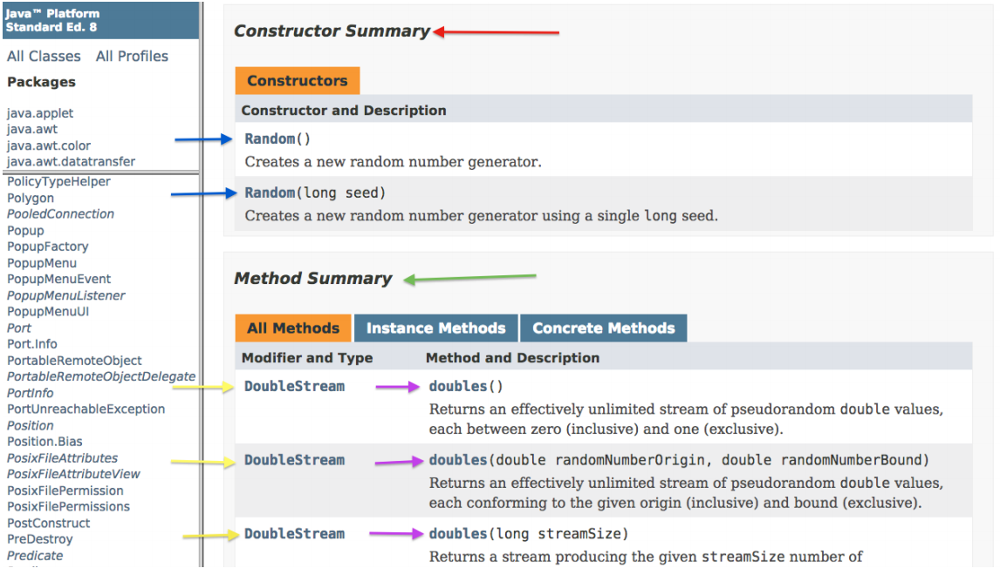
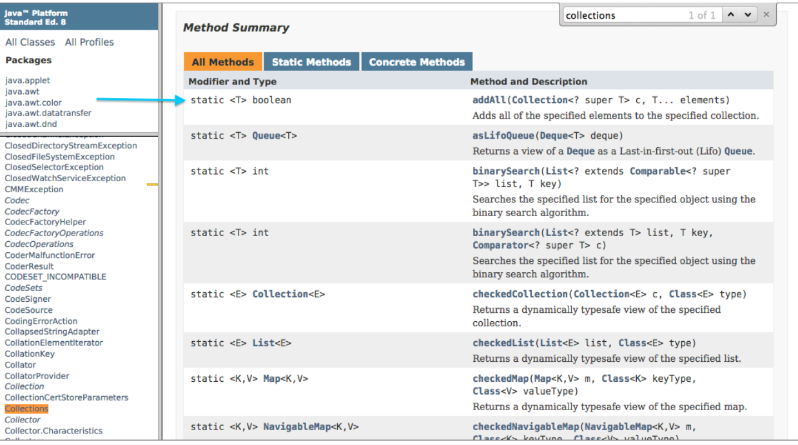
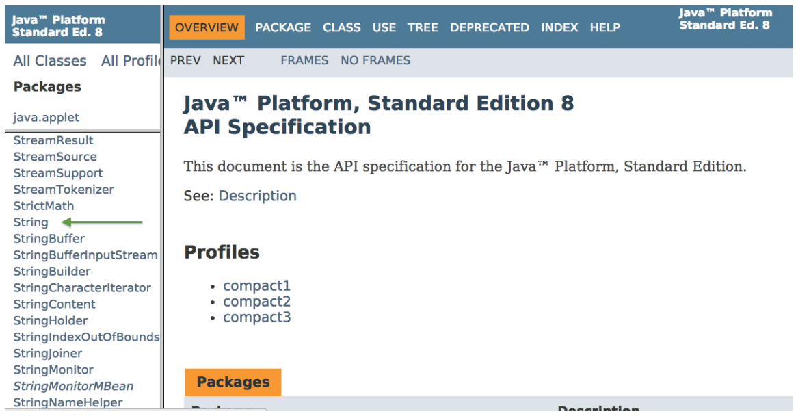
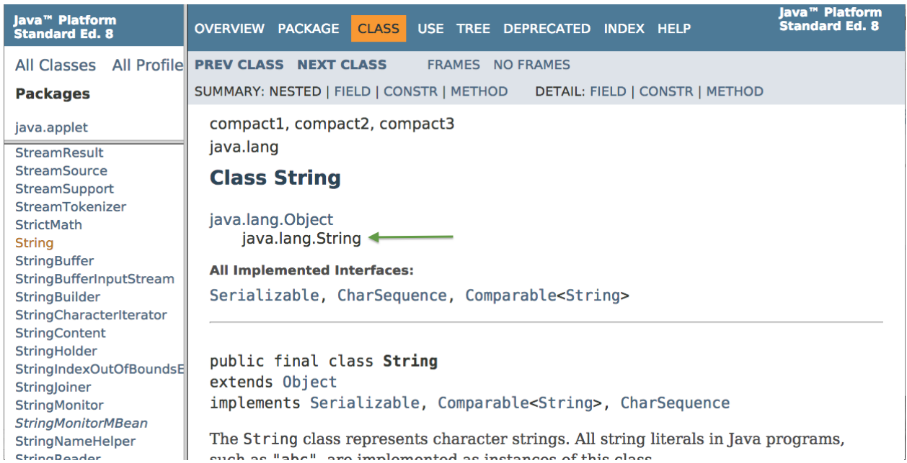
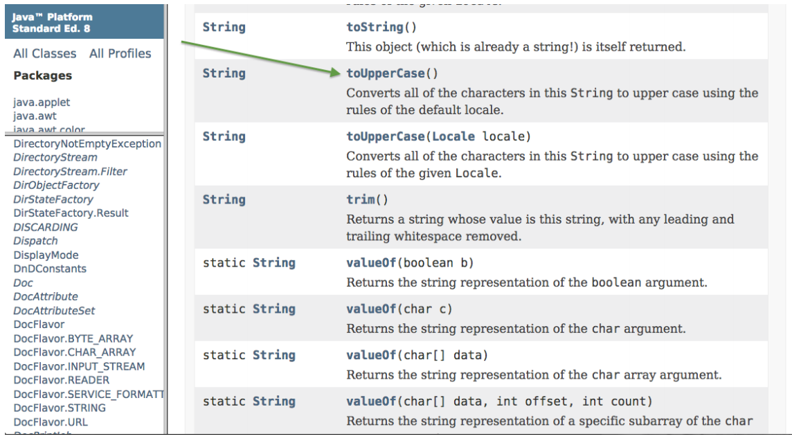
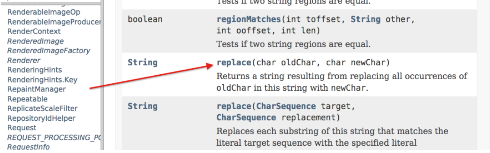

# Understanding the API

by **Amanda Moreton**, with updates by the staff of CS 1331

### What is the API?

API stands for Application Programming Interface. It holds information for all of the classes that you get with the Java Development Environment. It’s awesome! Other people have done some work that we can use to make our own work easier. The API can be a super useful tool if you know how to use it. Let’s figure out how to take advantage of all the API has to offer.

## Parts of the API

### The Homepage

* Top left: a list of all of the packages you have access to (Think of packages like folders in your own computer. The packages contain the classes in the API)

* Bottom left: a list of all the classes we can look through and use. There are a bunch, so use CONTROL + F to search for a specific class quickly. Interfaces are in italics.

* “Frames”/”No frames” at the top refers to the packages and classes panels on the left. If you cannot see the panels to search through, you can click “FRAMES” to add them to your screen

### A Class Page

* BLUE ARROW: The name of the class is at the top in bold

    * YELLOW ARROW: Underneath, we see the package where this class is held. We need to import the bottom line of the hierarchy (in this case, java.util.Random) in order to be able to make an object of this class. We **do not** need to import if the class is in java.lang.

    * RED & GREEN ARROWS: Java tells us which interfaces this class implements, if any, and what classes are subclasses of this class, if any.

* FIRST CHUNK OF TEXT: Sometimes, this intro text holds a code example with an object of the given class. Unfortunately, not this time :(

Scroll further down on the page to find…

### Constructor and Method Info

* RED ARROW: Constructor Summary
    * BLUE ARROWS: Constructors
        * We see all the different constructors available to us to make an object of this class. Here, we see one that takes in no arguments, and one that takes in an argument called seed of type long. If we need more info on either of these constructors, we can click on it for a more detailed description.

* GREEN ARROW: Method Summary
    * PURPLE ARROWS: Methods
        * We see all of the methods that exist within this class, along with the parameters they take in. If we need more info on a method, we can click on it for a more detailed description.

    * YELLOW ARROWS: Return types
        * The type that is returned by each method is listed to the method name’s left. If these methods were static, it would be stated here as well.

Let's check out the Collections class's method summary for an example of static methods

* BLUE ARROW: static
    * Notice how the keyword static is in front of the return type. Now we know we need to call this method by typing `Collections.methodName()`

**Now, let’s practice!**

Let’s try to change a String to be uppercase and replace all “A”s with “X”s.

#### 1. Let’s find the String class on the homepage

#### 2. In order to use all of the methods in the String class, do we need to import anything?

Nope! The `String` class is in the `java.lang` package, so we have access to it automatically. This makes sense, since we can create a new `String` whenever we want, as we've already seen!

#### 3. Let's scroll down to look for a method to make our String uppercase

`toUpperCase()` looks good! It takes in no parameters and converts all of the characters in the String to upper case. We have to call this method on a String because the `toUpperCase()` method is an instance method.

We would know if it was a static method because it would say static in front of the return type, like it does for the valueOf methods. It’s important to note that this method returns a String. It is not changing our pre-existing String. So, if we have the String:

    String stringToChange = “Today is a beautiful day!”;

We can save the upper case version in a new variable:

    String changedString = stringToChange.toUpperCase();

If we print out changedString, it will read:

    “TODAY IS A BEAUTIFUL DAY!”

#### 4. Next, let's see if there's a method to help us replace all of our "A"s with "X"s

Perfect! This method works similarly to the `toUpperCase()` method, but takes in parameters. All we have to do is specify that we want to replace ‘A’, our old character, with ‘X’, our new character.

This time, instead of using a new variable, let’s reassign our changedString variable:

    changedString = changedString.replace(‘A’, ‘X’);

Our new string would print out:

    “TODXY IS X BEXUTIFUL DXY!”
