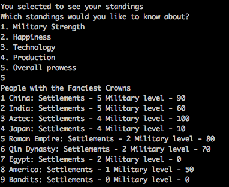
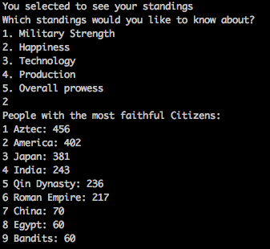
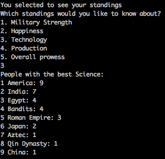

# Homework 05

Version: 1.0

Due: 2016-11-10T23:59:59

## TODO
[Download zip](hw5.zip)

## Introduction

[Civilization](https://en.wikipedia.org/wiki/Civilization_(video_game)) is a turn-based strategy game centered around founding and building a civilization. More commonly referred to as Sid Meier's Civilization, the game has been around since 1991 and has since developed somewhat of a cult following. This semester we are going to be implementing our own version of this game for your homework assignments and by the end of the semester you will have a working game you can show off to your friends! If you are not familiar with Civilization, there is a [free version](https://en.wikipedia.org/wiki/Freeciv) that you can play in order to get familiar with the game.

This assignment will get you working with Comparable and Comparator. This project will:

- Assess your understanding of collections on a conceptual level
- Test your ability to use different Collections algorithms
- Require proper usage of Comparable and Comparator through conceptual understanding of written descriptions.


## Problem Description
So far we have explored many aspects of OOP through Java Inheritance and Polymorphism. We have also fully explored such concepts as exceptions and data abstraction.
Now we will spend time finishing up our understanding of collections through iterators and collections algorithms.
Note that this assignment has two distinct parts.

## Before we begin...
* Like all homework descriptions, it is very important you read and understand this entire document.
* It is important to note that you will not need to create a new repository for this homework. You will be working in the same git repository you set up for the first homework.
* This homework will be very focused on details. So make sure you read the description carefully and implement every detail described!
* Most of this code is revised from HW04 code, so you will need to replace any duplicated files in your repository with the new versions.

## Solution Description Part A
Last week you implemented a Set. There is one thing that was missing from that implementation of a set, though. Most Collections are `Iterable` which allows objects to be the target of a "for-each" loop. You will implement the `Iterable` interface in your `MySet` implementation. Note that a working `MySet` implementation has been provided to you with the previous homework's requirements.

For the iterator() method, you will be defining a private class which implements the Iterator interface. Private classes are classes defined within another class, and have access to private instance variables in their surrounding class. Because your custom Iterator will need to know the state of your backing array, we must make the Iterator a private class instead of a separate class. You will need to fill out the three methods the Iterator interface requires: hasNext(), next(), and remove(). Finally, your iterator() method should return a new instance of your private Iterator class.

Feel free to refer to [the java API](https://docs.oracle.com/javase/8/docs/api/java/lang/Iterable.html) as well as notes from class to learn more about what is needed to implement `Iterable`.

The provided code won't work as it relies on your `MySet` to be `Iterable` in order to work. If you want to work on Part B when you have not completed Part A, just comment out the code that uses the `MySet` iterator.

## Solution Description Part B

We have spent this semester so far building an implementation of the game Civilization from the ground up. We have implemented many interesting features through the use of java and OOP concepts. However, we have no real way to keep track of our progress or compare ourselves to other players in an attempt to see how we compare. But now that we know how to compare objects effectively we can implement this functionality!

* If you run the game you will notice that a new menu option is available: `See Standings`. When this option is selected, the user has the ability to see how they compare to other civilizations in the game. Your job is to implement the functionality of listing out the different types of standings.
* The user wants to be able to compare themselves to other Civilizations.
* The natural ordering of Civilizations is determined through military prowess.
* The other ways to order Civilizations include
  * by the happiness of their citizens
  * by the amount of Tech Points they have
  * by the amount of Resources they have
  * by their overall Prowess
     * Overall Prowess is determined by first comparing how many settlements the Civilizations have (more is better) and then by the Civilizations' military prowess.
* When a user makes a selection the Civilizations should be printed out from highest to lowest
* Make use of the different algorithms you learned in class to accomplish this!

You will specifically need to edit the `standings` method in `Model.java` in the `model` package. Some of it is stubbed out for you. You just need to add the code that provides the appropriate functionality described above.

You must make use of the methods, interfaces, etc. discussed in class in order to receive credit for this assignment.

### Example Output

Below is some example output of what your code should produce once you have completed the assignment.
Your code should order the Civilizations correctly as shown in the examples as well as provide the appropriate amounts of resources, techpoints, etc. that they were ranked by.
Note that your code will not produce these exact numbers as they are produced randomly when the game starts.





## Consider the Following...
* Note: When making new classes, remember that we are working with multiple packages. You will have to specify what package each file belongs to at the top of the file. Read through some of the provided files to see how to do this. It is also suggested that you look through the files to understand the interplay between all of the different parts.
* Note: You might notice that all of the classes in the model package, with the exception of Model, do not have an access modifier, making them package private. This is by design to prevent access to these classes from outside the package. Any class you create for this project should have package private access.

## Conclusion
* If everything worked out right, you should now be able to compile and play your game the same as homework 4! The only difference from homework 4 is that there should be the option to list out how you compare to other civilizations playing against you!

## Extra Challenges

The following is not necessary for you to do but might be interesting.
You might notice if you look in `Model.java` that the other Civilizations created are just initialized to beginning values and not ever changed. It might be interesting to actually change the code to dynamically change how these Civilizations procede as your user plays the game. This implementation would be a very basic AI, so if you are interested in AI you can try to implement competing players with the provided code.
**This is not extra credit**. This just might be interesting for you to explore since the code is set up well to implement a very basic AI.

## Compiling and Running
* This project makes use of several different packages to manage its many files. As a result, compiling and running this project is a bit different from projects you have worked on in the past.
* Since our files are in many different packages, we have to make sure they get linked together properly. We do this by setting the class path when we compile and when we run.
* To compile the program in its totality run this command:

```bash
$ javac -cp src/main/java src/main/java/runner/*.java src/main/java/model/*.java src/main/java/view/*.java src/main/java/controller/*.java
```

* That command instructs java to compile all of our files while considering src/main/java to be our classpath.
* To run the program, you should run:

```bash
$ java -cp src/main/java runner.CivilizationGame
```

## Checkstyle
* Remember that you may lose checkstyle points for this homework! So, make sure that you are frequently running checkstyle on your code to ensure that you don't lost unnecessary points.
* There are currently three checkstyle errors in the homework that you are not responsible for. These are caused by some provided constructors taking in more than 7 parameters. You will not be penalized for these two checkstyle errors.
* **The checkstyle cap on this assignment is 100 points**, where you lose one point per error.

## Verifying Your Submission
Please be sure that any code you push compiles and runs through the command line! Pull from your repository and make sure everything is working how you want it!
