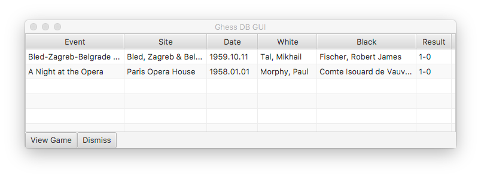

# Homework 6 - Chess Database GUI

## Introduction

In this homework you will practice:

- using domain objects designed to work with JavaFX, and
- writing a simple GUI in JavaFX.

## Problem Description

You have a bunch of PGN games and want to display them easily.

## Solution Description

Write a GUI program in a file named `ChessGui.java` that displays the metadata of [`ChessGame`](ChessGame.java)s, one per line, of each game in [`ChessDb`](ChessDb.java) in a [TableView](https://docs.oracle.com/javafx/2/api/javafx/scene/control/TableView.html). In the bottom of the main screen should be two buttons: "View" and "Dismiss".

"View" should be disabled if no game is selected in the table. If a game is selected, "View" should be enabled and, when clicked, should show a dialog box with the metadata and moves of the selected game in a [ListView](https://docs.oracle.com/javafx/2/api/javafx/scene/control/ListView.html) or some other GUI control of your choosing.

"Dismiss" should exit the program.

Your main screen should look something like this:

Once you figure out how to hook up the domain objects that we give you ([`ChessGame`](ChessGame.java) and [`ChessDb`](ChessDb.java)) to the [TableView](https://docs.oracle.com/javafx/2/api/javafx/scene/control/TableView.html), this assignment is very easy.

## Extra Credit

- Add a search feature to your GUI that allows the user to search for games by a specific player, or games that Black won, or any other useful thing you can think of.

- Add a field for Opening to [`ChessGame`](ChessGame.java) that is automatically calculated from the moves of the game. In addition to any games you add in the step below, recognize the following openings: [Giuoco Piano](https://en.wikipedia.org/wiki/Giuoco_Piano), [Ruy Lopez](https://en.wikipedia.org/wiki/Ruy_Lopez), [Sicilian Defence](https://en.wikipedia.org/wiki/Sicilian_Defence), [Queen's Gambit](https://en.wikipedia.org/wiki/Queen%27s_Gambit), [Indian Defence](https://en.wikipedia.org/wiki/Indian_Defence), and [Philidor Defence](https://en.wikipedia.org/wiki/Philidor_Defence)

- Re-use or re-write your PGN reader from hw1 and incorporate it into your GUI so that, in addition to the games in [`ChessDb`](ChessDb.java), all the games in PGN files in the same directory as your `ChessGui` are also displayed in the table.

  - If you add the ability read PGN files to your GUI, please submit your test PGN files as attachments with your submission so we can test your code with the same files.

## Tips and Considerations

The [JavaFx API](https://docs.oracle.com/javafx/2/api/index.html) contains everything you will need for this assignment. Please look for a solution to any problem in the API **before** you ask on Piazza.

## Checkstyle

Checkstyle deduction will be capped at 50 points for this homework.
Use the -a flag when running checkstyle! JavaDocs will be counted for this homework.

**Submit code that compiles!!!**

Non compiling code will receive an automatic zero.

## Turn-in Procedure

Submit each of your Java source files necessary for all the files in your chess game database to compile on T-Square as separate attachments.  When you're ready, double-check that you have submitted and not just saved a draft. **Download each file and compile them to assure that nothing went wrong with the submission process.**

## Verify the Success of Your Submission to T-Square

Practice safe submission! Verify that your HW files were truly submitted correctly, the upload was successful, and that your program runs with no syntax or runtime errors. It is solely your responsibility to turn in your homework and practice this safe submission safeguard.

- After uploading the files to T-Square you should receive an email from T-Square listing the names of the files that were uploaded and received. If you do not get the confirmation email almost immediately, something is wrong with your HW submission and/or your email. Even receiving the email does not guarantee that you turned in exactly what you intended.
- After submitting the files to T-Square, return to the Assignment menu option and this homework. It should show the submitted files.
- Download copies of your submitted files from the T-Square Assignment page placing them in a new folder.
- Re-run and test the files you downloaded from T-Square to make sure it's what you expect.
- This procedure helps guard against a few things.

    - It helps insure that you turn in the correct files.
    - It helps you realize if you omit a file or files. Missing files will not be given any credit, and non-compiling/non-running homework solutions will receive few to zero points. Also recall that late homework will not be accepted regardless of excuse. Treat the due date with respect.  Do not wait until the last minute!
(If you do discover that you omitted a file, submit all of your files again, not just the missing one.)
    - Helps find syntax errors or runtime errors that you may have added after you last tested your code.