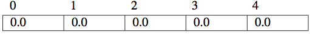
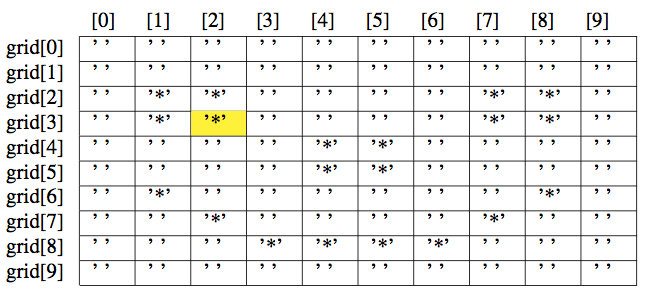

# Arrays

# Modeling Aggregates

As you've seen, you can get pretty far with "scalar" data.  But many phenomena we wish to model computationally are aggregates, or collections, for example:

-  scores on assignments in a class,
-  word counts in a document, or
-  pixel colors in a bitmap image.

Today we'll learn Java's most basic facility for modeling aggregates: arrays.

# Java Arrays

Java Arrays (\href{http://docs.oracle.com/javase/specs/jls/se8/html/jls-10.html}{JLS \S 10}):

-  are objects,
-  are dynamically allocated (e.g., with operator ``new``), and
-  have a fixed number of elements of the same type.


# Creating Arrays


Consider the following *array creation expression* [JLS 10.3](http://docs.oracle.com/javase/specs/jls/se8/html/jls-10.html#jls-10.3):

```Java
double[] scores = new double[5];
```

This declaration:

-  allocates a 5-element array,
-  the ``5`` in the example above can be any expression that is unary promotable to an ``int`` [JLS 5.6.1](http://docs.oracle.com/javase/specs/jls/se8/html/jls-5.html#jls-5.6.1)
-  stores the address of this new array in ``scores``, and
-  initializes each value to it's default value (``0`` for numeric types, ``false`` for ``boolean`` types, and ``null`` for references [JLS 4.12.5](http://docs.oracle.com/javase/specs/jls/se8/html/jls-4.html#jls-4.12.5).


# Array Declarations

The preceding array definition

```
double[] scores = new double[5];
```

could be split into a declaration and initialization:
```Java
double[] scores;
scores = new double[5];
```
Can put the ``[]`` on the type or the variable.  These two declarations are equivalent:

```Java
double[] scores;
double scores[];
```
Better style to put the ``[]`` on the type.

# Mixed Declarations

Can mix array and variable declarations when element type same as variable type.  The declaration line:

```Java
double scores[], average;
```
creates

-  an array of ``double`` reference named ``scores``, and
-  a ``double`` variable named ``average``

What's the size of the ``scores`` array declared above?

# Array Objects

After the definition:

```Java
double[] scores = new double[5];
```
``scores`` points to an array object that can be visualized as:



# Indices and Size


- The *indexes* of ``scores`` range from 0 to 4.
- Size of array stored in a ``public final`` instance variable named ``length``

```Java
scores.length == 5;
```
What is the type and value of the expression above?

# Array Elements

Array elements addressed with ``int``-promotable expression in square brackets (``[]``)

```Java
double[] scores = new double[5];
scores[0] = 89;
scores[1] = 100;
scores[2] = 95.6;
scores[3] = 84.5;
scores[4] = 91;
scores[scores.length - 1] = 99.2;
```

Will this line compile?  If so, what will happen at runtime?

```Java
scores[scores.length] = 100;
```

# Initializing Arrays

You can provide initial values for (small) arrays
```Java
String[] validSuits = {"diamonds", "clubs", "hearts","spades"};
```

-  What is ``validSuits.length``?
-  What is ``validSuits[1]``?

You can also use a loop to initialize the values of an array:

```Java
int[] squares = new int[5];
for (int i = 0; i < squares.length; ++i) {
    squares[i] = i*i;
}
```

What is ``squares[4]``?

# Traversing Arrays

Arrays and ``for`` go hand-in-hand:

```Java
double[] scores = new double[5];
for (int i = 0; i < 5; ++i) {
    System.out.printf("scores[%d] = %.2f%n", i, scores[i]);
}
```

Can also use the "enhanced" for:

```Java
for (double score: scores) {
    System.out.println(score);
}
```

Read the enhanced for as "for each element in array ...".

Why use for-each instead of traditional for? ...


# ``for`` Versus ``for``-each

If you don't need the index, use the enhanced for loop.

```Java
double sum = 0.0;
for (int i = 0; i < scores.length; ++i) {
    sum += scores[i];
}
```

- ``scores.length`` is used only for bounding the array traversal
- ``i`` is only used for sequential array access.

Those are two things we can mess up.

# Enhanced ``for``

The enhanced for loop is cleaner:

```Java
double sum = 0.0;
for (double score: scores) {
    sum += score;
}
```

Also note how our naming conventions help to make the code clear.  You can read the loop above as "for each score in scores".

# Array Creation Gotchas

Because arrays are allocated dynamically, this will compile:

```Java
double[] scores = new double[-5];
```

becuase the compiler only checks that `-5` is an `int` expression, but the code will produce an error at run-time:

```Java
Exception in thread "main" java.lang.NegativeArraySizeException
        at ArrayBasics.main(ArrayBasics.java:4)
```

# Array Access Gotchas

Array access expressions are also merely type-checked at compile time but are evaluated and checked for validity at run-time. Negative indexes like:

```Java
scores[-1] = 100;
```

produce:

```Java
Exception in thread "main" java.lang.ArrayIndexOutOfBoundsException: -1
        at ArrayBasics.main(ArrayBasics.java:23)
```

... just like an index too large for the array would fail.

# Array Parameters

We've already seen an array parameter:
```Java
public static void main(String[] args)
```

We can use this array just like we use any other array.
```Java
public class Shout {

    public static void main(String[] args) {
        for (String arg: args) {
            System.out.print(arg.toUpperCase() + " ");

        System.out.println();

}
```
See also [CourseAverage.java](code/arrays/CourseAverage.java)

# Variable Arity Parameters

-  The *arity* of a method is its number of formal parameters.
-  The last parameter to a method may be a *variable arity parameter*, a.k.a. *var args* parameter [JLS 8.4.1](http://docs.oracle.com/javase/specs/jls/se8/html/jls-8.html#jls-8.4.1), whose syntax is simply to add an ellipse (``...``) after the type name.

```Java
public static int max(int ... numbers)
```

# Accessing Var Args Parameters

Var args parameter is an array inside the method.

```Java
public static int max(int ... numbers) {
    int max = numbers[0];
    for (int i = 1; i < numbers.length; ++i) {
        if (numbers[i] > max) max = number;
    }
    return max;
}
```

# Multidimensional Arrays

You can create multidimensional arrays by adding additional square brackets for dimensions and sizes.

```Java
char[][] grid;
```

-  Declares a 2-dimensional array of  ``char``
-  As with one-dimensinal arrays, ``char`` is the element type
-  Each element of ``grid``, which is indexed by two ``int`` expressions, is a ``char`` variable

# Initializing 2D Arrays


With ``new``:
```Java
grid = new char[10][10];
```

# Initializing 2D Arrays - Literally

```Java
char[][] grid = {{' ', ' ', ' ', ' ', ' ', ' ', ' ', ' ', ' ', ' '},
                 {' ', ' ', ' ', ' ', ' ', ' ', ' ', ' ', ' ', ' '},
                 {' ', '*', '*', ' ', ' ', ' ', ' ', '*', '*', ' '},
                 {' ', '*', '*', ' ', ' ', ' ', ' ', '*', '*', ' '},
                 {' ', ' ', ' ', ' ', '*', '*', ' ', ' ', ' ', ' '},
                 {' ', ' ', ' ', ' ', '*', '*', ' ', ' ', ' ', ' '},
                 {' ', '*', ' ', ' ', ' ', ' ', ' ', ' ', '*', ' '},
                 {' ', ' ', '*', ' ', ' ', ' ', ' ', '*', ' ', ' '},
                 {' ', ' ', ' ', '*', '*', '*', '*', ' ', ' ', ' '},
                 {' ', ' ', ' ', ' ', ' ', ' ', ' ', ' ', ' ', ' '}};
```

A 2-d array is an array of 1-d arrays


# Visualizing 2D Arrays


``grid`` array can be visualized as a 2-d grid of cells.



Individual element addressed by supplying two indices:

```Java
grid[3][2] == '*'; // true
```


# Traversing 2D Arrays

Traverse 2-dimensional array by nesting loops.  Key is to use the right ``length``s. Row-major traversal:

```Java
for (int row = 0; row < grid.length; ++row) {
    for (int col = 0; col < grid[row].length; ++col) {
        System.out.print(grid[row][col]);
    }
    System.out.println();
}
```

Column-major traversal:

```Java
for (int col = 0; col < grid[0].length; ++col) {
    for (int row = 0; row < grid.length; ++row) {
        System.out.print(grid[row][col]);
    }
    System.out.println();
}
```

See [Smiley.java](code/arrays/Smiley.java)


# Closing Thoughts


-  Arrays are our first "collection classes" (but are not Java "Collections" classes).
-  Arrays are objects, so array objects are created with operator ``new`` and array variables can have the value ``null``.
-  Arrays have sugar to add convenience and make them syntactically similar to C's arrays.
