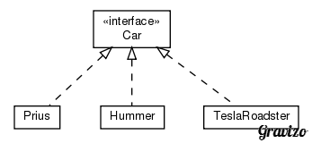

---
---
layout: homework
title: Cars Programming Quiz
---

[Download Zip](pq-cars.zip)

## Intro

In this programming quiz you will apply principles of subtype polymorphism to
the redesign of a family of classes and extend this family using your new
polymorphic design.

## Problem Description

We've been simulating different cars to determine their range and horsepower,
that is, how far they can go on a full tank of gas. We've explored some
different vehicles, including traditional gasoline-powered cars and hybrids.
Now we'd like to look at a new car, but there's just one problem: It's
electric. (Boogie woogie woogie!) That means no gas, and no gas tank!  Electic
cars still have a range, based on a full battery charge, so we can do the same
operation (calculating range), but it will require an entirely different
implementation.

## Solution Description

1. Create an interface class called ``Car`` which will be the interface for all
of the classes that represent cars.

2. Modify each of the existing car classes listed above so that they implement
``Car``.

4. Each of the existing car classes has a ``double getRange()`` method that
returns a double describing how many miles that car can travel on a full tank
of gas. Each also has a ``int getHorsepower()`` method that returns the car's
horsepower. Make both these methods polymorphic so that you could have a
reference variable of type ``Car`` that references an object of type ``Prius``,
``Hummer``, or ``TeslaRoadster`` and you could invoke the ``double getRange()``
and ``int getHorsepower()`` methods on that object. There is a commented-out
section of ``Ranges`` in ``src/main/java`` that shows how this might work.

5. Add a new class, ``TeslaRoadster`` which implements ``Car``.

 - ``TeslaRoadster`` should have a constructor that takes in an `int horsepower`
    and a `double range`. It should use these to set the value of corresponding
    instance fields.

 - ``TeslaRoadster``'s ``double getRange()`` method should return a double with
   the value that was passed into the constructor.

 - ``TeslaRoadster``'s ``int getHorsepower()`` method should return an int with
   the value that was passed into the constructor.

After refactoring the existing classes, adding `Car` and `TeslaRoadster`, your
classes will have the following relationship. Note that this only shows the
class/interface relationships; variables and methods are omitted from this
diagram.

)

## Submission
- Run `gradle -q build` to get a report of style errors, test failures, and a final grade. If this completes without a compilation failure, proceed to submit with:
- `java -jar pq-submit.jar` (Download [pq-submit.jar](pq-submit.jar).)
- **Non-compiling solutions will receive a 0!**

### Tips:
- Stub out the required constructors and methods in your classes with dummy return values so that it (just barely!) compiles successfully and then go ahead and submit. This will get you *some* points and is better than waiting to submit until the end.
- Look at the test code in `src/test/java` to see how your class is used.
