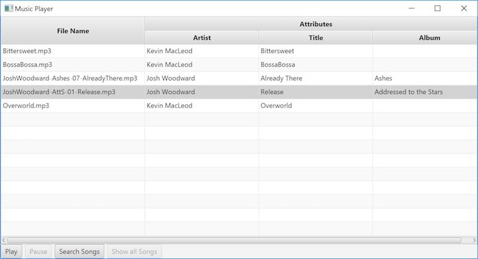

# Homework 7 - Music Player

## Introduction

In this assignment you will practice

* Using the JavaFX framwork
* Playing media with Java
* Applying your knowledge from the semester

## Problem Description

In this assignment, you will be creating a GUI to let you read and play mp3 music files.

## Solution Description

Write a GUI program named `MusicPlayer.java` that reads all of the mp3 files in a folder, lists them, let's you play the files, and allows you to filter them.

Your program should display the mp3 files in the same directory as `MusicPlayer.java` as [`Media`](https://docs.oracle.com/javase/9/docs/api/javafx/scene/media/Media.html) objects in a [`TableView`](https://docs.oracle.com/javase/9/docs/api/javafx/scene/control/TableView.html). The table should display a column called File Name and a column called Attributes. Under Attributes, the program should display the Artist, Title, and Album associated with the mp3 file.

Under the TableView, there should be four buttons:
* "Play" should play the audio of the selected file.
* "Pause" should pause a song if there is one playing.
* "Search Songs" should show a dialog box that asks for the user to input a search term and lets them choose what category they want to search by (File name, Artist, etc.). If the user proceeds, the program should filter out anything that doesn't match the search term in the table.
* "Show all Songs" should display all of the songs initially displayed.

Sample display of [these mp3 files](songs.zip):

The user should not be able to both click "Play" and "Pause", only one should be clickable at a time. The same goes for "Search Songs" and "Show all Songs". There should never be more than one song playing. Name your window, "Music Player".

Unlike previous assignments, **you are allowed to import _almost_ any class in the Java Standard Library** to help you do this assignment. All classes that come from packages that start with `java` or `javafx` are fine, just don't use anything that is in the `javax` package.

## Grading

**Submit code that compiles!!!**

Non-compiling code will receive a 0. For this homework, you need to earn at least 50 points in order to get any points at all on your course grade from this assignment.

* `MusicPlayer` (100 points)

    * [20] All mp3 files are read from the folder and displayed
    * [15] The file names of each mp3 file are displayed in the table under a column called "File Name"
    * [15] Play button plays the selected song in the table
    * [10] Pause button stops playing all music
    * [20] Follows the formatting instructions set forth by the description
    * [10] Correctly displays attributes of the mp3 file in a separate column
    * [5] Search feature works properly
    * [5] Show all Songs works after searching

## Tips and Considerations

Be sure to look in the [JavaFX API](https://docs.oracle.com/javase/9/docs/api/javafx.graphics-summary.html) for a solution to your problem, **before** asking on Piazza.

Prioritize your work to get as many points as you can. Even if you cannot display the attributes and cannot implement a search function, there would still be 80 potential points you could get.

[`MediaPlayer`](https://docs.oracle.com/javase/9/docs/api/javafx/scene/media/MediaPlayer.html) is a very handy class for this assignment.

## Checkstyle

For each of your homework assignments we will run checkstyle and deduct one point for every checkstyle error.

For this homework the **checkstyle cap is 100**, meaning you can lose up to 100 points on this assignment due to style errors.

- If you encounter trouble running checkstyle, check Piazza for a solution and/or ask a TA as soon as you can!
- You can run checkstyle on your code by using the jar file found on the course website. To check the style of your code run  `java -jar <path-to-checkstyle.jar> -a MusicPlayer.java`.
- Javadoc errors are the same as checkstyle errors, as in each one is worth a single point and they are counted towards the checkstyle cap.
- **You will be responsible for running checkstyle on *ALL* of your code.**
- Depending on your editor, you might be able to change some settings to make it easier to write style-compliant code. See the [customization tips](http://cs1331.gatech.edu/customization-tips.html) page for more information.

## Collaboration

When completing homeworks for CS 1331 you may talk with other students about:

- What general strategies or algorithms you used to solve problems in the homeworks
- Parts of the homework specification you are unsure of and need more explanation
- Online resources that helped you find a solution
- Key course concepts and Java language features used in your solution
- **You may not discuss, show, or share by other means the specifics of your code, including screenshots, file sharing, or showing someone else the code on your computer, or use code shared by others.**

### Examples of approved/disapproved collaboration:

**OKAY:** "Hey, I'm really confused on how we are supposed to implement this part of the homework. What strategies/resources did you use to solve it?"

**BY NO MEANS OKAY:** "Hey... the homework is due in like 20 minutes... Can I see your code? I *promise* won't copy it directly!"

In addition to the above rules, note that it is not allowed to upload your code to any sort of public repository. This could be considered an Honor Code violation, even if it is after the homework is due.

## Submission

Submit only `MusicPlayer.java` and no other attatchments such as mp3 files.  When you're ready, double-check that you have submitted and not just saved a draft. **Download the file and compile it to assure that nothing went wrong with the submission process.**

File needed:

- MusicPlayer.java

## Verify the Success of Your Submission to Canvas

Practice safe submission! Verify that your HW file was truly submitted correctly, the upload was successful, and that your program runs with no syntax or runtime errors. It is solely your responsibility to turn in your homework and practice this safe submission safeguard.

- After submitting the files to Canvas, return to the Assignment menu option and this homework. It should show the submitted files.
- Download copies of your submitted files from the Canvas Assignment page placing them in a new folder.
- Re-run and test the files you downloaded from Canvas to make sure it's what you expect.
- This procedure helps guard against a few things.
    - It helps ensure that you turn in the correct files.
    - It helps you realize if you omit a file or files. Missing files will not be given any credit, and non-compiling/non-running homework solutions will receive few to zero points. Also recall that late homework will not be accepted regardless of excuse. Treat the due date with respect.  Do not wait until the last minute!
(If you do discover that you omitted a file, submit all of your files again, not just the missing one.)
    - Helps find syntax errors or runtime errors that you may have added after you last tested your code.