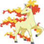
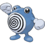
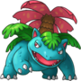
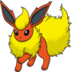

# CS1331 Homework 4 - Pokemon Battle

[HW4 Files](hw4.zip)

## Introduction

In this assignment, you will be using inheritance and polymorphism to depict Pokemon and their interactions.

## Problem Description

You wanna be the very best (programmer), like no one ever was! To have great Object Oriented Design is your real test, to learn it is your cause!

>Note: You don't need any prior knowledge about Pokemon to succeed with this assignment. The instructions will provide all necessary information to help you understand what needs to be done.

You will be given a GUI that represents the Pokemon world, separated into territories that help or hinder certain types of Pokemon. Within this world you will build classes that represent 5 different species of Pokemon. You will then form logic to make Pokemon species (instances) of different types interact with others.

## Solution Description

Three blank files have been provided for you with the correct names, you should write your code in these files.

### PokeWorld

We are giving you a GUI that represents the Pokemon world. The three files that represent this are: `PokeBattle.java`, `PokeWorld.java`,
and `ControlPanel.java`. Also, we have included `Pokemon.java` with one method filled out for you.

   * `PokeBattle.java` is the driver for your program. You should not need to edit this file.
   * `PokeWorld.java` is the panel in which your Pokemon will be running around. Each Pokemon is represented by an image of its species, which will move around the PokeWorld. You should not need to edit this file.
   * `ControlPanel.java` is a panel with buttons that will control which Pokemon gets instantiated next onto the GUI.
   * `Pokemon.java` is the abstract parent class for all your Pokemon species. We are giving you the shell for this class with the a few methods already written for you.

Because we are giving you a GUI structure to work with, we will require you to name some methods and classes in a specific way. If you see the name of a class or method that you need to write mentioned in this document, you should name it as such.

**You will need to change `ControlPanel.java` (check the TODOs at lines 18 and 44) and `PokeWorld.java` (check the TODO at line 165) to accommodate your custom Pokemon.**

### Pokemon Hierarchy

The main purpose of this assignment is to implement the classification of Pokemon species within the Pokemon world. Remember, you will be making instances of these Pokemon that run around in your GUI and interact with other instances of other Pokemon. We will be giving you a little bit of guidance on specific methods to write, but a large part of this assignment will be you designing classes on your own!

#### `Pokemon` class

The top level of your hierarchy should be an abstract class called `Pokemon`. We have provided you with a stub for this class that includes the `draw(Graphics g)` method implemented. This
class will have certain instance variables and methods that all `Pokemon` will have in common.

Remember what the purpose of an *abstract method* is and when to use them. We won’t tell you which of these methods should be abstract, but you should make good design decisions and figure it out on your own.
Here are the methods that the GUI requires from `Pokemon`. You must implement these methods for the GUI to work. You may add more methods if you’d like, but always remember to use good OOP design.

   * `move()` will move the `Pokemon` instance in a random yet effective manner. All this means is that you have some sort of randomness in your movement and aren't simply hardcoding a circular path for the `Pokemon`, nothing super fancy :D. Every time the instance moves, its `level` should increase and it's `health` should decrease. You should also make sure the instance stays within the bounds of the Pokemon world (hint: check out the `bounds` variable in `PokeWorld.java`).

   * `collidesWithPokemon(Pokemon otherPokemon)` returns whether or not the current instance of a `Pokemon` is colliding with another given instance of a `Pokemon`. This can be determined using the location and dimensions of the Pokemon images.

   * `canReproduceWithPokemon(Pokemon otherPokemon)` returns whether or not the two Pokemon can reproduce. Two Pokemon can only reproduce if they are of the same Pokemon species.

   * `reproduceWithPokemon(Pokemon otherPokemon)` if the two Pokemon are able to reproduce (as determined by `canReproduceWithPokemon()`) this method returns a new Pokemon of the same type and in the same location. If for some reason, re-production does not happen, null should be returned. Even if one Pokemon can reproduce with another, you should still limit the chance of reproduction somehow such that you don’t infinitely reproduce. Think about giving reproduction some random chance of occurring if the Pokemon are colliding with each other.

   * `isOld()` returns whether or not an instance of a Pokemon has surpassed some determined maximum level.

   * `canHarmPokemon(Pokemon otherPokemon)` determines whether or not the current instance of a Pokemon can harm an instance of the other Pokemon through combat.

   * `harmPokemon(Pokemon otherPokemon)` if the current Pokemon can harm the other Pokemon (as determined by `canHarmPokemon()`) then it decreases the other Pokemon’s health by some amount. How lethal Pokemon are is up to you! Experiment with different values to see different results in your simulation.

   * `faint()` called when the instance faints for one reason or another; change the health of your instance to actually make faint.

   * `hasFainted()` returns whether or not the instance has fainted (ie health = 0 or if they have exceeded maximum level).

   * Additionally, you must add any instance variables, getters, and setter methods you may require. Remember to keep your data `private` - only give access or modification power where necessary.

The Pokemon world will be divided geometrically into four sections. The sections provide benefits to their corresponding types: the Fire section (orange), the Grass section (green), the Water section (blue), and one remaining section to be explained below (white).

### Pokemon types

Some notes about all Pokemon Types:

   * You determine with what probability a Pokemon of some type can harm another Pokemon of the same type, but it must be nonzero.

#### `FireType`

   When a `FireType` is in its orange quadrant (top-right), they move more quickly than they do in the other areas of the map (think about adding speed instance data?)

   A `FireType` also has a greater chance of harming a `GrassType` and a lesser chance of harming a `WaterType`. The actual values that represent the probabilities are up to you!

#### `WaterType`

   When a `WaterType` is in its blue quadrant (bottom-left), they level up more rapidly than they do in the other areas of the map

   A `WaterType` also has a greater chance of harming a `FireType` and a lesser chance of harming a `GrassType`. The actual values that represent the probabilities are up to you!

#### `GrassType`

   When a `GrassType` is in its green quadrant (top-left), they gain health rather than lose it.

   A `GrassType` also has a greater chance of harming a `WaterType` and a lesser chance of harming a `FireType`. The actual values that represent the probabilities are up to you!

#### Special`Type`

   >Note: You can call this class whatever you want (though coding convention highly suggests it be Something`Type` for clarity).

   The harming relationship between your special type and the other given types can be whatever you decide, but _make sure to include it when you are writing the classes for the other types!_

   When a special type Pokemon is in its white quadrant (bottom-right), it gains any combination of the available abilities. Just ensure that it receives at least one ability.

### Pokemon Species

Some notes about all Pokemon species:

- A Pokemon species can only reproduce with its own species.

#### `Rapidash`

   

   The fire Pokemon `Rapidash` is a powerful Pokemon that can vanquish its enemies.

   * If a `Rapidash` is fighting a Fire type Pokemon and its level is higher than that of the Pokemon it is fighting, then it has a 90% chance of harming the other Fire type. Otherwise, it has a 12% chance. If not fighting a Fire type, Rapidash has the same chance of beating others as any other Fire type.
   * `Rapidash` has the highest maximum level of any Pokemon other than `Poliwhirl`.
   * `Rapidash` has the highest chance of reproduction.

#### `Poliwhirl`

   

   The water Pokemon `Poliwhirl` is titan of aquatic prowess.

   * If a `Poliwhirl` is fighting another `Poliwhirl`, its chance of harming is 12% _less than_ its chance of harming any other Water type Pokemon. Otherwise, its chances of harming a Pokemon are equivalent to those of other Water type Pokemon.
   * The `Poliwhirl` species can have a maximum level of 200

#### `Venusaur`

   

   The grass Pokemon `Venusaur` lets nothing get in its way, championing a flower on its back like a boss.

   * Due to its powerful build, a `Venusaur` has a 10% higher chance of harming a Fire type Pokemon than another Grass type Pokemon would be. It can also harm a Poliwhirl 70% of the time, but it only has normal Grass type hit rates against all other types and species.
   * Venusaur can reproduce with another Venusaur, but only 5% of the time.
   * `Venusaur` has the smallest maximum level of any Pokemon species.

#### Special Species

   This Pokemon must be *of the special type* you choose to create. You can give it any additional abilities and rules, as long as it doesn't break any of the species rules provided.

   If you are familiar with Pokemon, feel free to use a Pokemon you particularly like! If not, no worries; you can use one that we have provided for you or make up a Pokemon name you like and pick any old image.

   For this assignment, you will also need to add an image for your special species. We have provided two additional images that you may use:

     and  

   If you want to use your own image put it in the `src/main/resources` folder with the other images we've provided. Just use http://image.online-convert.com/convert-to-png to convert it to png format, and specify an image size of 90 pixels x 90 pixels there as well!

### General Tips
   Here are some general tips for this assignment!

   * Re-read this entire document. It’s long, it’s complicated, but it’s meant to be like that. Oftentimes you will deal with complicated problem specs that may not make much sense the first time you read it. Take notes, draw pictures, and make sure you know exactly what’s going on before you start coding.
   * Remember, a large part of this assignment is a good hierarchy and good Object Oriented Design, so really put a lot of time and effort into designing this in a smart way.
   * We will be grading largely on functionality, although we will of course be looking at your code too. Make sure we can actually see the interactions we’ve described here between the Pokemon! If your reproduction rate is too high or too low, we might not be able to tell if your program is doing what it’s supposed to be.
   * It’s ok if on a collision, both Pokemon harm one another, or both Pokemon reproduce with the same partner.
   * **Hint: (0,0) is the top left pixel of the screen.**
   * To compile your code use `javac *.java` while in the `java` directory. Then run PokeBattle with `java PokeBattle`.

## Javadocs

- You will need to write Javadoc comments along with checkstyling your submission.

    - Every class should have a class level Javadoc that includes `@author <GT Username>` and `@version <version #>`.

    - Every method should have a Javadoc explaining what the method does and includes any of the following tags if applicable.

        - `@param <parameter name> <brief description of parameter>`

        - `@returns <brief description of what is returned>`

        - `@throws <Exception> <brief explanation of when the given exception is thrown>`

- See the [CS 1331 Style Guide](http://cs1331.gatech.edu/cs1331-style-guide.html) section on Javadoc comments for examples.

## Checkstyle
You must run checkstyle on your submission. The checkstyle cap for this submission is **45** points. In future homeworks we will be increasing this cap, so get into the habit of fixing these style errors early!

A guide for setting up and running checkstyle can be found on [this page on the course website](http://cs1331.gatech.edu/cs1331-style-guide.html). Make sure you click "Save" when downloading the jar file, and not "Run". To run, copy the jar file into the registration folder. Run checkstyle for this assignment with `java -jar checkstyle-6.2.2.jar -a *.java`. This will check for both checkstyle errors and javadoc errors.

## Collaboration with other students
When completing homeworks for CS1331 you may talk with other students about:

- what general strategies or algorithms you used to solve problems in the homeworks
- parts of the homework you are unsure of and need more explanation
- online resources that helped you find a solution
- Key course concepts and Java language features used in your solution

You may **not** discuss, show, or share by other means the specifics of your code, including screenshots, file sharing, or showing someone else the code on your computer, or use code shared by others.

Examples of approved/disapproved collaboration:

- **approved**: "Hey, I'm really confused on how we are supposed to implement this part of the homework. What strategies/resources did you use to solve it?"
- **disapproved**: "Yo it's 10:40 on Thursday... can I see your code? I won't copy it directly I promise"

Collaborating with others in a way that violates the approved means is a Georgia Tech Honor Code violation, and you will also break your TAs hearts :broken_heart:

## Turn-in Procedure

Export the hw4 folder and its contents to a .zip file and submit the .zip file on T-Square as an attachment. Make sure your zip includes all necessary files to run the program! When you're ready, double-check that you have submitted and not just saved a draft.

## Verify the Success of Your Submission to T-Square

Practice safe submission! Verify that your HW files were truly submitted correctly, the upload was successful, and that your program runs with no syntax or runtime errors. It is solely your responsibility to turn in your homework and practice this safe submission safeguard.

- After uploading the files to T-Square you should receive an email from T-Square listing the names of the files that were uploaded and received. If you do not get the confirmation email almost immediately, something is wrong with your HW submission and/or your email. Even receiving the email does not guarantee that you turned in exactly what you intended.
- After submitting the files to T-Square, return to the Assignment menu option and this homework. It should show the submitted files.
- Download copies of your submitted files from the T-Square Assignment page placing them in a new folder.
- Re-run and test the files you downloaded from T-Square to make sure it's what you expect.
- This procedure helps guard against a few things.

    - It helps insure that you turn in the correct files.
    - It helps you realize if you omit a file or files. Missing files will not be given any credit, and non-compiling/non-running homework solutions will receive few to zero points. Also recall that late homework will not be accepted regardless of excuse. Treat the due date with respect.  Do not wait until the last minute!
(If you do discover that you omitted a file, submit all of your files again, not just the missing one.)
    - Helps find syntax errors or runtime errors that you may have added after you last tested your code.
